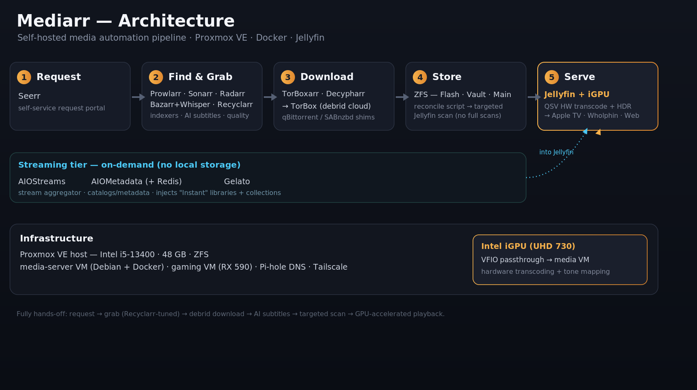

# Mediarr — Build Guide

A step-by-step guide to building this self-hosted media stack: a **streaming-first** media server where most content plays on demand through debrid, automated end-to-end from request to playback, with GPU-accelerated transcoding and a custom targeted-scan workflow.



---

## How it fits together

```
Wholphin (TV) ─► Seerr ─► Sonarr/Radarr ─► Prowlarr indexers ─► TorBox (Decypharr torrents / TorBoxarr usenet)
                                                                         │
                                          /srv/media/library  ◄──────────┘  (targeted scan)
                                                                         │
                                                                         ▼
                          Bazarr subs ◄── Jellyfin ──► hardware transcode ──► clients

   AIOMetadata catalogs ─► AIOStreams (TorBox) ─► Gelato ─► Instant libraries + Collections (no storage)
```

Two tiers, one Jellyfin front-end: a **local** tier (downloaded + kept) and an **Instant** streaming tier (browse/stream huge catalogs with no local storage).

---

## The guide, in build order

| # | Section | What it covers |
| --- | --- | --- |
| 01 | [Requirements](01-requirements.md) | Hardware (min/recommended), software, paid services + free alternatives, accounts to create |
| 02 | [Host & Storage](02-host-and-storage.md) | Docker host, the `/srv/media` layout, permissions, mounts |
| 03 | [Docker Stacks](03-docker-stacks.md) | Compose layout, `.env`, bringing services up |
| 04 | [Downloads](04-downloads.md) | TorBox + Decypharr (torrents) + TorBoxarr (usenet) |
| 05 | [Sonarr & Radarr](05-arr-suite.md) | Root folders, anime routing, quality profiles, naming, download clients |
| 06 | [Indexers (Prowlarr)](06-indexers.md) | Indexers + sync to the *arr apps + anime tag routing |
| 07 | [Subtitles](07-subtitles.md) | Bazarr (local) + subbuzz (Instant) + Whisper fallback |
| 08 | [Jellyfin](08-jellyfin.md) | Libraries, plugins, trickplay/chapters, scheduled tasks, collections |
| 09 | [Requests (Seerr)](09-requests.md) | Seerr + the Wholphin client |
| 10 | [Streaming Tier](10-streaming-tier.md) | AIOStreams + AIOMetadata + Gelato (the Instant backbone) |

**Optional / deeper dives:**

| Section | What it covers |
| --- | --- |
| [Recyclarr & Quality Profiles](optional/recyclarr.md) | TRaSH-Guides baseline + how to build a profile |
| [Hardware Transcoding](optional/hardware-transcoding.md) | Intel iGPU passthrough + QSV/VPP (with AMD/NVIDIA/software notes) |
| [Targeted Scanning](optional/targeted-scanning.md) | TargetedScan plugin + reconcile script (no full scans) |
| [Library Covers](optional/library-covers.md) | Branded library tile art |
| [Design Notes](design-notes.md) | The *why* behind every key decision |

---

## At a glance

- **Infra:** any Linux + Docker host (this build: a Debian VM on Proxmox, with the Intel iGPU passed through).
- **Acquisition:** Sonarr · Radarr · Prowlarr · Bazarr · Recyclarr · Flaresolverr, fed by TorBox via Decypharr (torrents) + TorBoxarr (usenet/NZBFinder).
- **Server:** Jellyfin — hardware QSV transcoding, targeted scanning, local + Instant libraries.
- **Streaming tier:** AIOStreams + AIOMetadata + Gelato → on-demand Instant libraries and merged collections.
- **Front-end:** Wholphin on TV → Seerr for requests.

## Credits

Catalogs by **[luckynumb3rs](https://luckynumb3rs.github.io/stremio-perfect-setup/)** · AIOStreams template by **[Tam-Taro](https://github.com/Tam-Taro/SEL-Filtering-and-Sorting)** · quality profiles from **[TRaSH Guides](https://trash-guides.info)**. Built on the work of the Jellyfin, *arr, AIOStreams, AIOMetadata, and Gelato projects.
