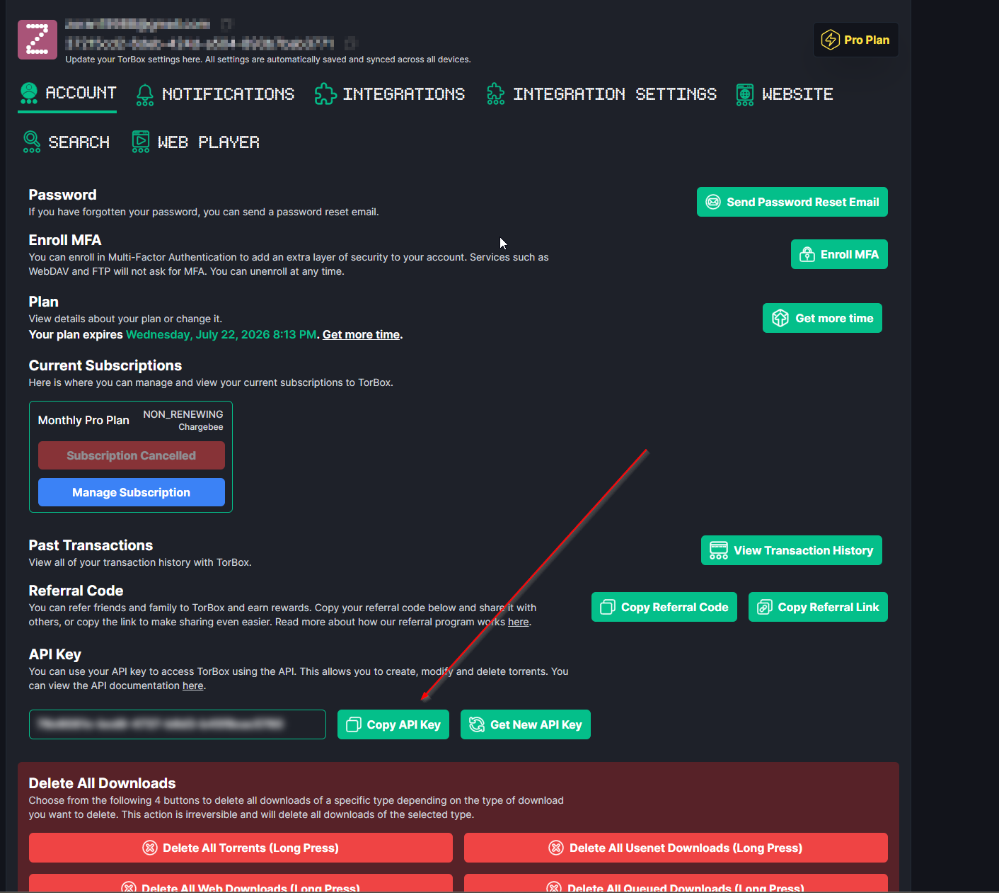
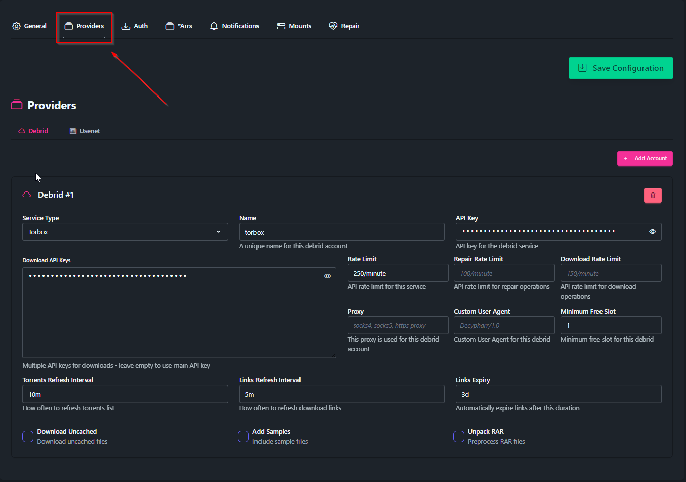

# 04 · Downloads (Debrid + Usenet)

This is the layer that actually *fetches* media. The setup uses **TorBox** as the backend, reached two ways:

- **Decypharr** → TorBox **torrents** (cached/instant), emulates a qBittorrent client
- **TorBoxarr** → TorBox **usenet** (NZBs from NZBFinder), emulates a SABnzbd client

Sonarr/Radarr just see "a qBittorrent" and "a SABnzbd" and send grabs to them — they don't know or care that it's debrid underneath.

> **Why two clients?** Decypharr handles TorBox torrents brilliantly but doesn't support TorBox *usenet*, so TorBoxarr fills that gap. Torrents = instant cached pulls; usenet = excellent retention/quality via NZBFinder.

---

## 1. TorBox account + API token

Sign up for **[TorBox](https://torbox.app)** (Pro plan for full usenet + torrent). Then grab your API token from the TorBox dashboard → **Settings → API**.



You'll use this token in both Decypharr and TorBoxarr.

---

## 2. Decypharr — TorBox torrents (qBittorrent shim)

Decypharr logs into TorBox, exposes a qBittorrent-compatible API to the *arr apps, and **mounts** the debrid content as a local filesystem at `/mnt/debrid` (via rclone/FUSE) so Jellyfin can play it.

Open its web UI at `http://<host-ip>:8282` and configure:

**Debrid provider** — add TorBox with your API token:



Key options used in this build:
- **`download_uncached: false`** — only grab content TorBox already has cached, so pulls are *instant* (no waiting for a download to finish).
- **Repair** (enabled, 24h) — periodically re-checks and re-fetches dead debrid links so your library doesn't rot.
- **Mount** at `/mnt/debrid` — this is what makes streamed content visible to the rest of the stack.

---

## 3. TorBoxarr — TorBox usenet (SABnzbd shim)

TorBoxarr presents a SABnzbd-compatible API. Sonarr/Radarr send it NZBs (grabbed from NZBFinder), and it pushes them through TorBox's usenet, then drops the files where the *arr apps expect them.

It's configured entirely by `.env` (in `/opt/torboxarr/.env`):

```bash
TORBOXARR_TORBOX_API_TOKEN=your-torbox-token
TORBOXARR_QBIT_PASSWORD=pick-anything       # used by the qBit-compat side
TORBOXARR_SAB_API_KEY=pick-anything         # you'll paste this into Sonarr/Radarr
```

It listens on `http://<host-ip>:8085`. (NZBFinder itself is added as an *indexer* in Prowlarr — that's the next step.)

---

> **Connecting these to Sonarr/Radarr happens later** — see [`05-arr-suite.md`](05-arr-suite.md). The *arr apps aren't configured yet at this point, so here we only stand up the two backends; we wire them in (as a qBittorrent and a SABnzbd download client), and connect Decypharr back to the *arr apps, once Sonarr/Radarr exist.

---

## How a grab flows

```
Sonarr/Radarr  →  (torrent) → Decypharr → TorBox cache → /mnt/debrid → imported
               →  (NZB)     → TorBoxarr → TorBox usenet → downloaded → imported
```

Because downloads and the library share `/srv/media`, the import is an instant hardlink/move — no copying.

---

*(Decypharr's *Arrs connection and the qBittorrent/SABnzbd download-client screenshots belong in `05-arr-suite.md`.)*

➡️ Next: [`05-arr-suite.md`](05-arr-suite.md)
