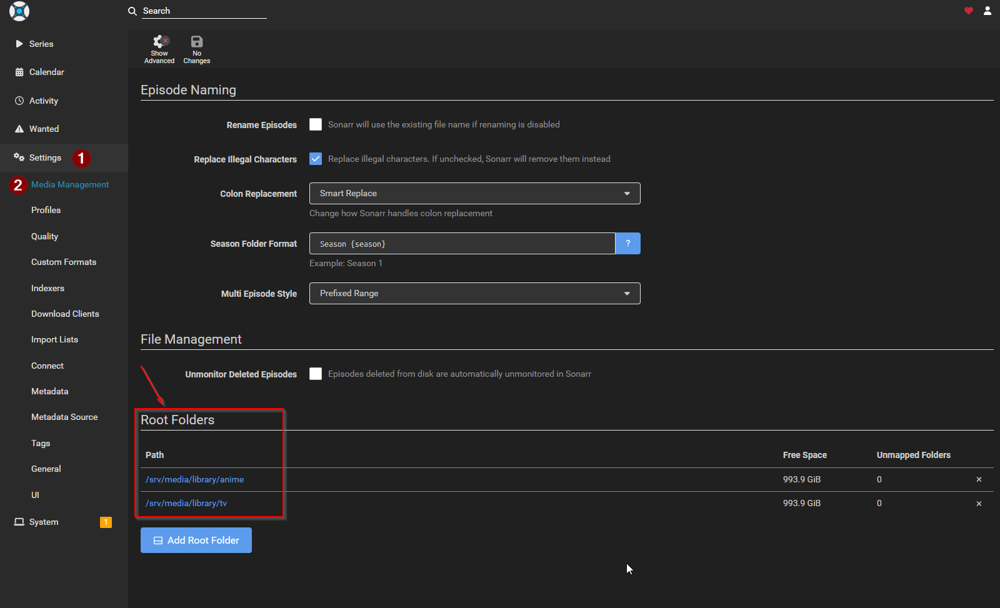
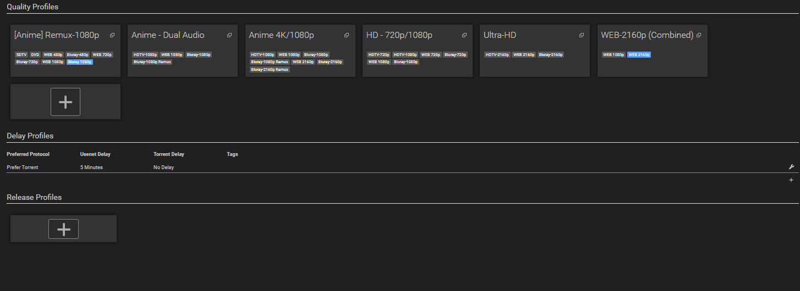
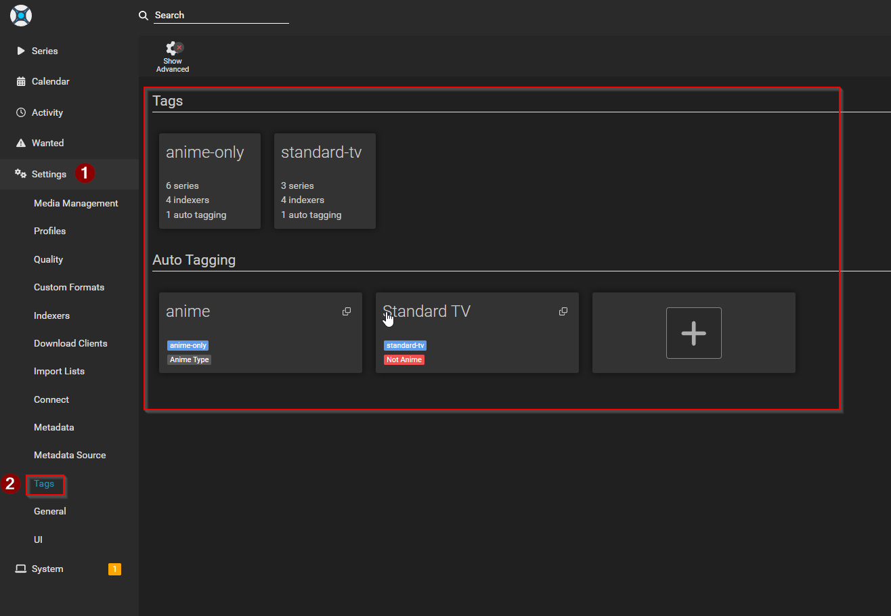
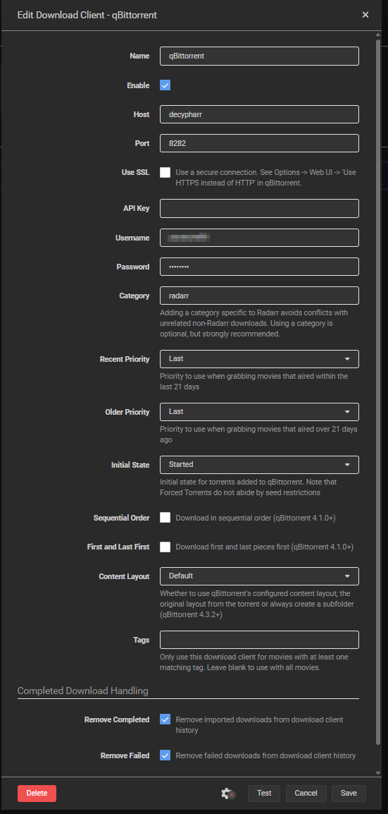
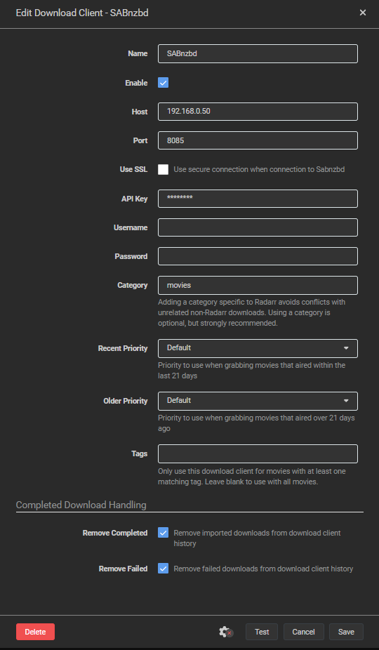
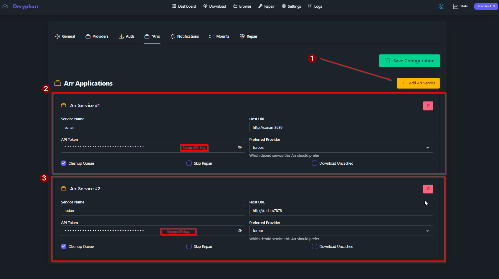

# 05 · Sonarr & Radarr

The brains of the operation: they decide **what** to grab, at **what quality**, and **where** it lands. Configure these before pointing indexers (Prowlarr) at them.

- Sonarr (TV + anime): `http://<host-ip>:8989`
- Radarr (movies): `http://<host-ip>:7878`

> **First run:** opening each app the first time prompts you to set a username/password. Then grab each one's **API key** from *Settings → General → Security* — Prowlarr, Seerr, and Decypharr all need it.

---

## 1. Root folders

*Settings → Media Management → Root Folders → +*

- **Sonarr:** `/srv/media/library/tv` **and** `/srv/media/library/anime`
- **Radarr:** `/srv/media/library/movies`

The separate **anime** root is what lets Jellyfin treat anime as its own library. (Anime *films* still go to `movies/` — only series use the anime root.)

---

## 2. Quality profiles

This build optimizes for the **best 4K HDR Remux**, with **no size cap** — a deliberate deviation from TRaSH Guides. (The size floor caused real misses: short-runtime anime films that were perfect quality but fell *under* TRaSH's minimum-size limit got rejected, so the lower bound was removed.)

> ⚠️ **A fresh Sonarr/Radarr only ships *default* profiles** (Any, HD-1080p, Ultra-HD…). The custom profiles below **don't exist out of the box** — they come from TRaSH Guides, set up via **Recyclarr** (recommended) or built by hand. See the Recyclarr subsection below.

Profiles in use:

| Sonarr | Radarr |
| --- | --- |
| Ultra-HD · WEB-2160p (Combined) | Ultra-HD · Remux 2160p (Combined) |
| HD - 720p/1080p | HD - 720p/1080p · HD Bluray + WEB |
| Anime 4K/1080p · [Anime] Remux-1080p · Anime - Dual Audio | Remux + WEB 2160p |

### Where these profiles come from

You have two paths to the custom profiles above:

- **Recyclarr (recommended)** — auto-imports a TRaSH-Guides baseline of custom formats + profiles, then you tweak on top.
- **By hand** — build them yourself in *Settings → Profiles*.

Both paths — plus a full walkthrough of how a quality profile actually works (qualities, cutoff, custom-format scoring) and how to apply this build's no-size-cap deviation — are covered in **[`optional/recyclarr.md`](optional/recyclarr.md)**. Want a solid baseline fast? Run Recyclarr. Want total control? Skip it and build your own.

---

## 3. Naming

This build **disables renaming** (`renameEpisodes` / `renameMovies` = off) — keeping the original release names, which plays nicer with matching and debrid. Folder/file formats used:

- Series folder: `{Series Title}` · Season folder: `Season {season}`
- Episode: `{Series Title} - S{season:00}E{episode:00} - {Episode Title} {Quality Full}`
- Movie folder: `{Movie Title} ({Release Year})`

(*Settings → Media Management* for the rename toggle, *Settings → Media Management → Episode/Movie Naming* for the formats.)

---

## 4. Tags & anime routing

Create two tags (*Settings → Tags* or on each series): **`anime-only`** and **`standard-tv`**.

These pair with **indexer tags in Prowlarr** (next step) so Sonarr only searches anime trackers for anime and general trackers for everything else. Anime series get the `anime-only` tag automatically when added via Sonarr's **Anime series type** (Seerr applies this — see step 09).

---

## 5. Add the download clients

Now that Decypharr + TorBoxarr exist (step 04), wire them into **both** Sonarr and Radarr — *Settings → Download Clients → +*:

**qBittorrent** → Decypharr (torrents):
- Host: `decypharr` (container name; or your VM IP) · Port: `8282`
- Username/Password: the qBit credentials from Decypharr · Category: `sonarr` / `radarr`

**SABnzbd** → TorBoxarr (usenet):
- Host: `torboxarr` (container name; or your VM IP) · Port: `8085`
- API Key: your `TORBOXARR_SAB_API_KEY` · Category: `sonarr` / `radarr`

Hit **Test** on each (green = reachable).

> Tip: prefer the **container name** (`decypharr`, `torboxarr`) over the IP — it's more portable and survives an IP change. The IP works too if the apps are on the same host.

---

## 6. Connect Decypharr back to Sonarr/Radarr

So Decypharr can clean up the queue and run repairs, point it at the *arr apps — Decypharr → **\*Arrs** → add Sonarr and Radarr (host + API key):

---

## 7. Hardlinks / instant moves

*Settings → Media Management* → enable **"Use Hardlinks instead of Copy"**. Because downloads and the library share `/srv/media`, imports are instant (no duplication, no copy time).

---

✅ Sonarr & Radarr now know their folders, quality targets, naming, tags, and have somewhere to send grabs. Next we feed them indexers.

➡️ Next: [`06-indexers.md`](06-indexers.md)
