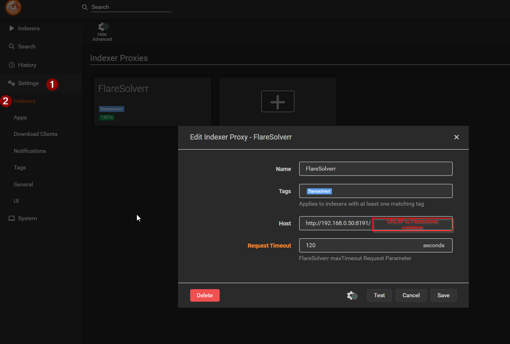
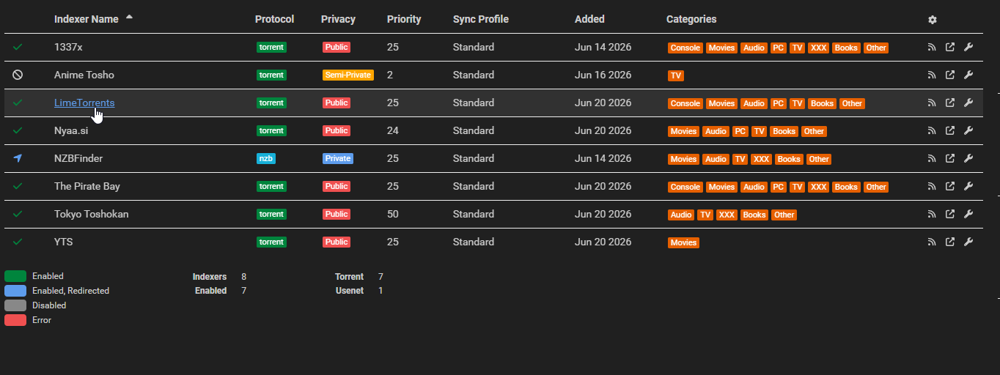
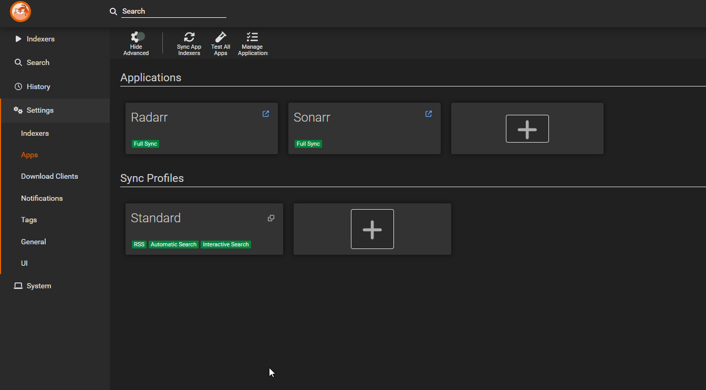

# 06 · Indexers (Prowlarr)

Prowlarr is the **indexer manager**. You add every indexer/tracker here once, connect it to Sonarr and Radarr, and Prowlarr keeps them in sync — so you never configure indexers inside the *arr apps directly.

Web UI: `http://<host-ip>:9696`

---

## 1. (Optional) FlareSolverr — for Cloudflare-protected sites

Some indexers sit behind Cloudflare. **FlareSolverr** solves those challenges so Prowlarr can reach them. It's already running (port 8191) from step 03.

Prowlarr → **Settings → Indexers → Indexer Proxies → + → FlareSolverr**:
- Host: `http://flaresolverr:8191`
- Tag: `flaresolverr`

Then add the `flaresolverr` tag to any indexer that needs it. If none of your indexers use Cloudflare, you can skip this.

---

## 2. Add your indexers

Prowlarr → **Indexers → Add Indexer**, search the name, fill in any required keys/credentials, and add. This build's set:

| Indexer | Type | Notes |
| --- | --- | --- |
| **NZBFinder** | Usenet | The NZB source for TorBoxarr (your usenet path) |
| **The Pirate Bay** | Torrent | General |
| **YTS** | Torrent | Movies |
| **LimeTorrents** | Torrent | General |
| **Nyaa.si** | Torrent | **Anime** |
| **Tokyo Toshokan** | Torrent | **Anime** |
| **AnimeTosho** | Torrent | Anime *(optional; disabled in this build)* |
| **1337x** | Torrent | General |

> Indexer choice is personal — use whatever works for you. The important split is **general** vs **anime** indexers, which powers the routing below.

---

## 3. Connect Sonarr & Radarr (Prowlarr "Apps")

Prowlarr → **Settings → Apps → + → Sonarr** (and again for **Radarr**):
- Prowlarr Server: `http://prowlarr:9696`
- Sonarr Server: `http://sonarr:8989` (or `http://radarr:7878`)
- API Key: from Sonarr/Radarr → Settings → General → API Key

Hit **Sync** and Prowlarr pushes all indexers into both apps. From now on, adding an indexer in Prowlarr automatically appears in Sonarr/Radarr.

---

## 4. Anime vs standard routing (the time-saver)

To stop Sonarr searching anime trackers for regular shows (and vice-versa), you use **tags**. This build uses two: `anime-only` and `standard-tv`.

How it works in Sonarr: an indexer only gets searched for a series **if their tags match** (an untagged indexer is used for everything). So:

- Tag the **anime indexers** (Nyaa, Tokyo Toshokan, AnimeTosho) → `anime-only`
- Tag the **general indexers** (TPB, YTS, LimeTorrents, NZBFinder) → `standard-tv`
- Anime series carry the `anime-only` tag (Sonarr's Anime profile / your add settings apply it); standard shows carry `standard-tv`

Result: an anime grab only hits anime trackers, a regular-show grab only hits general ones — no wasted searches, fewer false matches. You can apply these tags on the indexers in Prowlarr (and sync) or directly in Sonarr.

---

✅ Indexers are live and synced to both *arr apps, with anime/standard routing in place.

➡️ Next: [`07-subtitles.md`](07-subtitles.md)
