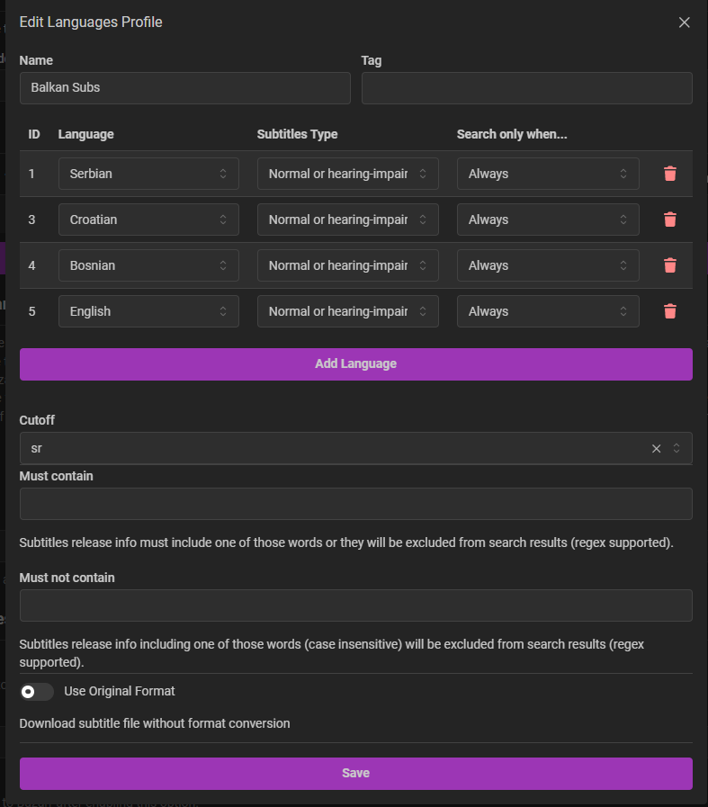

# 07 · Subtitles (Bazarr)

Bazarr watches your Sonarr/Radarr libraries and automatically fetches subtitles in the languages you want. Web UI: `http://<host-ip>:6767`.

---

## 1. Connect Sonarr & Radarr

*Settings → Sonarr* and *Settings → Radarr* — give each the host + API key, matching the paths your *arr apps use:

- Sonarr: `http://sonarr:8989` · Radarr: `http://radarr:7878`
- Make sure the **path mappings** line up — since everything uses `/srv/media`, no remapping is needed.

---

## 2. Languages

*Settings → Languages* — create a **Languages Profile** with the languages you want, then set it as default (and/or assign per series/movie).

This build:
- **English** — primary (most content)
- **Serbian** — local language (and the closely-related ex-Yugoslav subs cover a lot of regional content)

> Tip: set a sensible **cutoff** (a "good enough" score) so Bazarr stops once it finds a solid match instead of endlessly re-searching.

---

## 3. Providers

*Settings → Providers* — add the subtitle sources. This build, in rough priority order:

| Provider | Used for | Notes |
| --- | --- | --- |
| **OpenSubtitles.com (VIP)** | Everything | ~90% of the load. VIP = 1,000 downloads/day, no ads (see `01-requirements.md`) |
| **Titlovi** | Serbian / ex-YU | Strong regional/local-language coverage |
| **Podnapisi** | Serbian / ex-YU | Good secondary for local languages |
| **AnimeTosho** | Anime | Anime-specific subs |

> Free OpenSubtitles works too — VIP just raises the daily limit. For a non-Serbian setup, drop Titlovi/Podnapisi and keep OpenSubtitles (+ AnimeTosho if you watch anime).

---

## 4. Whisper — AI fallback for anime dubs *(planned)*

> ⚠️ **Not fully implemented yet** — documented as the intended design.

The goal is a **narrow** fallback: **anime dubbed shows that have no adequate English-dub transcribed subtitle**. For those, the regular providers often have nothing matching the dub, so Whisper (the `whisper` container, speech-to-text) transcribes the audio into a subtitle.

Intended setup:
- *Settings → Providers → Whisper*, endpoint `http://whisper:9000`.
- Order it **last / lowest priority** so it only runs when every real provider comes up empty — i.e. exactly the anime-dub gap, without overriding proper subtitles elsewhere.

> Whisper transcription is CPU-heavy and not as clean as human subs, which is why it's a *last-resort fallback*, not a primary provider. (Container tuning — `small.en`, int8, CPU cap — is in the compose; see `design-notes.md`.)

---

## 5. Instant (streaming) libraries — subbuzz

Important split: **Bazarr only works on local files.** It can't fetch subtitles for the **Instant** libraries, because Gelato's streaming items have no file on disk. Those are handled *inside Jellyfin* by the **subbuzz** plugin (a Jellyfin subtitle provider), alongside **Gelato Subtitles**.

subbuzz providers used here are a mix of English + Balkan sources: Addic7ed, OpenSubtitles.com, Podnapisi, Subf2me, Subs.sab.bz, Subsunacs.net, YIFY. Configure it in the plugin's settings (OpenSubtitles.com account, encoding → UTF-8).

So the division of labour is:

| Subtitles for… | Handled by |
| --- | --- |
| **Local** libraries (Movies, Shows, Anime) | **Bazarr** (primary) |
| **Instant** libraries (streaming) | **subbuzz** + Gelato Subtitles (inside Jellyfin) |

---

✅ Bazarr handles local subs (with local-language coverage + planned anime-dub fallback); subbuzz covers the streaming side.

➡️ Next: [`08-jellyfin.md`](08-jellyfin.md)
