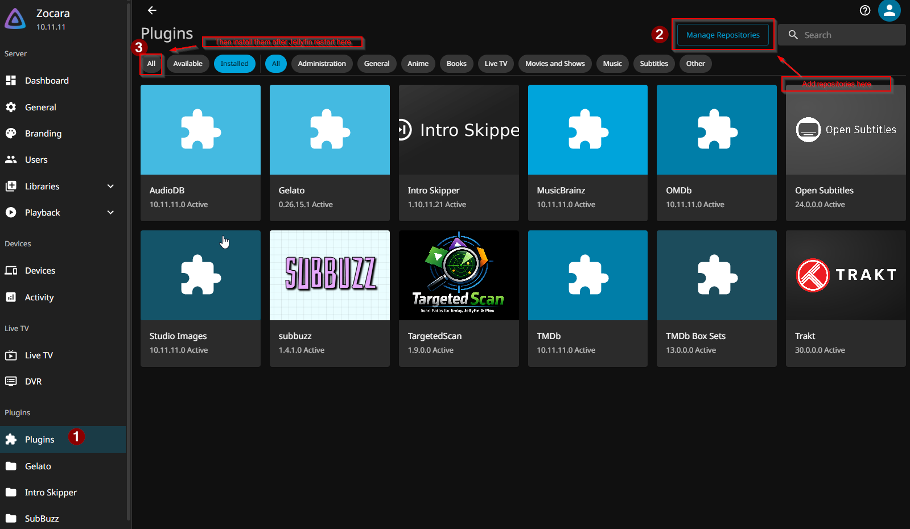

# 08 · Jellyfin

The media server the users actually see. This build is unusual in that it mixes **local** libraries (real files from the *arr apps) with **Instant** libraries (streaming, injected by Gelato), plus collections, hardware transcoding, and a custom targeted-scan workflow that avoids slow full scans.

Web UI: `http://<host-ip>:8096`. On first run, create your admin account.

---

## 1. Libraries

Six libraries, split into **local** and **Instant** (streaming):

| Library | Type | Source | Folder |
| --- | --- | --- | --- |
| **Movies** | Movies | local (Radarr) | `/srv/media/library/movies` |
| **Shows** | Shows | local (Sonarr) | `/srv/media/library/tv` |
| **Anime** | Shows | local (Sonarr) | `/srv/media/library/anime` |
| **Instant Movies** | Movies | Gelato (streaming) | `/srv/media/gelato/movies` |
| **Instant Shows** | Shows | Gelato (streaming) | `/srv/media/gelato/series` |
| **Collections** | Other (box sets) | TMDb Box Sets + Gelato | — |

- **Anime** is its own *Shows* library (separate from **Shows**) so it gets clean anime handling and its own artwork.
- The **Instant** libraries are populated by the **Gelato** plugin from your AIOStreams/AIOMetadata catalogs — covered in [`10-streaming-tier.md`](10-streaming-tier.md).
- **Collections** is an "Other / box set" library that holds both auto-created (TMDb Box Sets) and Gelato-injected collections.

> Optional: branded cover art for each library tile is in [`optional/library-covers.md`](optional/library-covers.md).

---

## 2. Plugins

> Jellyfin already **ships with** the standard metadata plugins — **TMDb, OMDb, Studio Images, AudioDB, MusicBrainz** — so those aren't listed here. Below are only the plugins this build **adds**, with their repos.

**From Jellyfin's official catalog** — *Dashboard → Plugins → Catalog → Install*:

| Plugin | Role | Repo |
| --- | --- | --- |
| **Trakt** | Scrobbles your watches to Trakt | [jellyfin/jellyfin-plugin-trakt](https://github.com/jellyfin/jellyfin-plugin-trakt) |
| **TMDb Box Sets** | Auto-creates movie collections | [jellyfin/jellyfin-plugin-tmdbboxsets](https://github.com/jellyfin/jellyfin-plugin-tmdbboxsets) |

**From custom repositories** — add the repo first (steps below):

| Plugin | Role | Repo / manifest |
| --- | --- | --- |
| **Gelato** | Instant libraries + collections from AIOStreams (see doc 10) | [lostb1t/Gelato](https://github.com/lostb1t/Gelato) · repo: `https://raw.githubusercontent.com/lostb1t/Gelato/refs/heads/gh-pages/repository.json` |
| **subbuzz** | Subtitles for the Instant libraries (see doc 07) | [josdion/subbuzz](https://github.com/josdion/subbuzz) |
| **TargetedScan** | Instant per-path scanning (`optional/targeted-scanning.md`) | [d3v1l1989/targeted-scans](https://github.com/d3v1l1989/targeted-scans) · manifest: `https://raw.githubusercontent.com/d3v1l1989/targeted-scans/main/manifest.json` |
| **Intro Skipper** | Intro/credits detection → skip button | [intro-skipper/intro-skipper](https://github.com/intro-skipper/intro-skipper) · manifest: `https://manifest.intro-skipper.org/manifest.json` |

### Installing a custom-repository plugin

1. *Dashboard → Plugins → **Repositories** → ➕* → paste the plugin's manifest/repository URL (from the table above).
2. Click the **Restart** button — the new repo won't appear until the server restarts.
3. **Hard-refresh** the dashboard in your browser: **Ctrl+Shift+R** — clears the cached UI so the new catalog entries show up.
4. *Dashboard → Plugins → **Catalog*** → find the plugin → **Install**; restart again if prompted.

> subbuzz can be installed via its repo or by copying the release DLL into the plugins folder — check its [README](https://github.com/josdion/subbuzz) for the current method.

---

## 3. Metadata

Metadata and artwork are left at **Jellyfin's defaults** — the installed plugins (TMDb as primary, OMDb/Studio Images filling in, Gelato for Instant items) handle it automatically. Nothing custom was configured per library.

---

## 4. Hardware transcoding

Configured via Intel QuickSync with VPP tone mapping. Full setup (including the iGPU passthrough) is its own optional guide: [`optional/hardware-transcoding.md`](optional/hardware-transcoding.md). If your clients direct-play, you may never need it.

---

## 5. Trickplay & chapter images

Both generate preview images via ffmpeg and are **resource-heavy**. This build's settings:

| | Trickplay | Chapter images |
| --- | --- | --- |
| **Local** libraries (Movies/Shows/Anime) | ON | ON |
| **Instant** libraries | OFF | OFF |
| **Extract during library scan** | **OFF** (decoupled) | **OFF** (decoupled) |

The key trick: **"Extract … during the library scan" is OFF**, so they run as their own background tasks instead of blocking/stalling the scan. Instant libraries have both off (no point on streaming items).

> 💡 Recommendation: they look nice (scrub previews + chapter menus) but take a long time and a lot of space. **If you don't need them, turn them off** — and if you do, hardware acceleration speeds generation up enormously.

---

## 6. Scheduled tasks — two important changes

This build **disables two default tasks**:

- ❌ **Scan Media Library** — a full scan crawls/hangs on the Instant (Gelato streaming) libraries. It's replaced by **targeted scanning** (TargetedScan plugin + the reconcile script — see `optional/targeted-scanning.md`), which adds new local media instantly without ever full-scanning.
- ❌ **Clean up collections and playlists** — this one **empties the collections that Gelato fills**, so it *must* be off or your Instant collections vanish.

Keep enabled: **Generate Trickplay Images** and **Chapter image extraction** (now background, not during scan), and **Intro Skipper** detection.

---

## 7. Targeted scanning (why there are no full scans)

Because full scans hang on the streaming libraries, this build never runs them. Instead, the **TargetedScan** plugin exposes an instant per-path scan endpoint, and a small reconcile script diffs disk vs. library every few minutes and scans only what's new. Full setup: [`optional/targeted-scanning.md`](optional/targeted-scanning.md).

---

## 8. Collections

- **TMDb Box Sets** auto-builds collections for movie franchises.
- **Gelato** injects catalog-based collections (including merged movie+series catalogs — see doc 10).
- Don't re-enable "Clean up collections and playlists" (it empties the Gelato ones).

---

## 9. Users & access

This build runs as a **single account on the local network only** — no remote/internet-facing access. So there's no multi-user or guest-permission setup to document. If you wanted to share with others, you'd add users (*Dashboard → Users*) and scope library access per user, but that's outside this build's scope.

## 10. Playback

Playback defaults (preferred audio/subtitle language, subtitle mode, etc.) are personal preference and per-user — nothing build-specific is prescribed here.

---

➡️ Next: [`09-requests.md`](09-requests.md)
