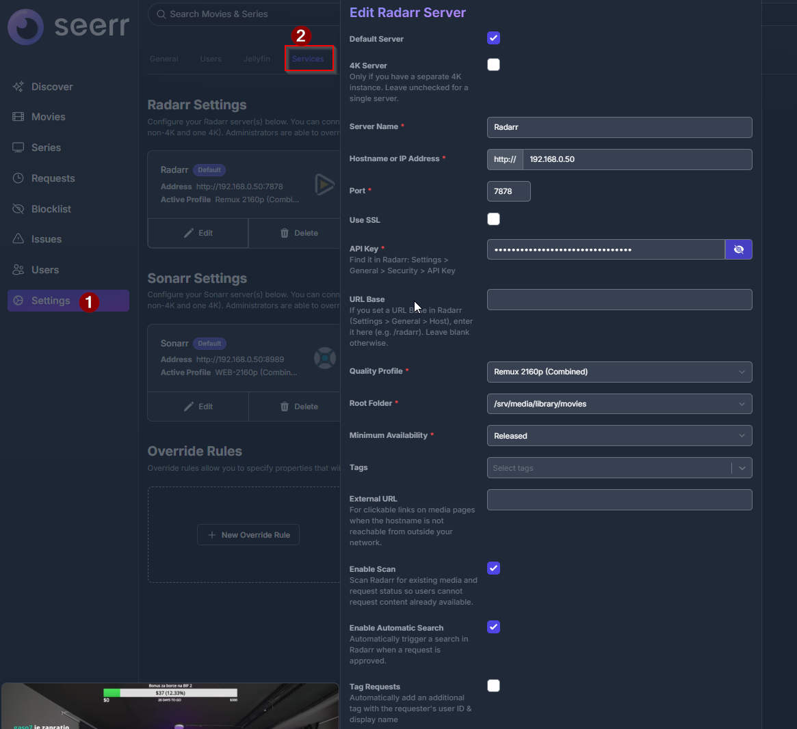
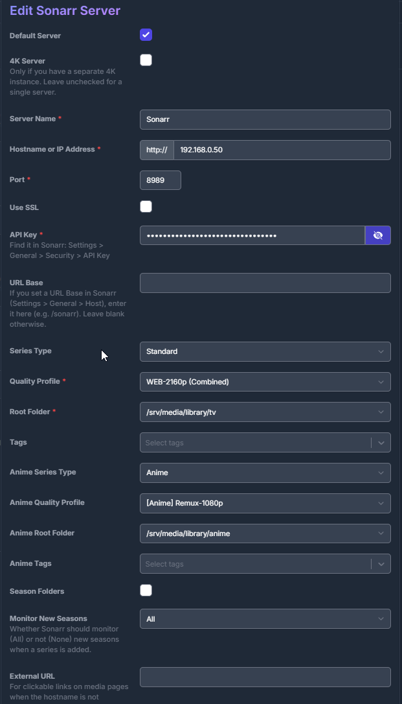

# 09 · Requests (Seerr) & the Wholphin client

> **Naming:** "Jellyseerr" and "Overseerr" merged into **Seerr** (`seerr-team/seerr`) in 2026 — both are now deprecated, and Seerr is the successor (it auto-migrates on first start). This build runs Seerr (`ghcr.io/seerr-team/seerr`, v3.x). The container may still be *named* `jellyseerr` in older compose files, but the app is **Seerr**.

**Seerr** is the request front-end: you browse, hit "request," and it tells Sonarr/Radarr to grab it — then it shows up in Jellyfin. **Wholphin** is the TV client people actually use, tying Jellyfin playback and Seerr requests together.

Seerr web UI: `http://<host-ip>:5055`.

---

## 1. Connect Jellyfin

On first run, Seerr links to your Jellyfin server for sign-in and library awareness (so it knows what you already have and won't let you re-request it). Point it at `http://jellyfin:8096` and sign in with your Jellyfin account.

> This build is single-account/local, so it's just your one account — no invite/guest management.

---

## 2. Connect Radarr

*Settings → Services → Radarr → Add* — values from this build:

- **Default Server:** on · **4K Server:** off (single server, no separate 4K instance)
- **Hostname:** `radarr` (the container name on the Docker network) — *or* your server's IP if Seerr runs elsewhere · **Port:** `7878` · API key from Radarr
- **Quality Profile:** `Remux 2160p (Combined)`
- **Root Folder:** `/srv/media/library/movies`
- **Minimum Availability:** Released
- **Enable Scan** ✔ · **Enable Automatic Search** ✔ (search fires automatically on approval)



---

## 3. Connect Sonarr (with anime auto-routing)

*Settings → Services → Sonarr → Add*. The important part is that Sonarr has **separate standard and anime defaults**, so anime requests route correctly with zero manual work:

- **Default Server:** on · **4K Server:** off
- **Hostname:** `sonarr` (container name) — *or* your server's IP · **Port:** `8989` · API key
- **Series Type:** Standard → **Quality Profile:** `WEB-2160p (Combined)` → **Root:** `/srv/media/library/tv`
- **Anime Series Type:** Anime → **Anime Quality Profile:** `[Anime] Remux-1080p` → **Anime Root:** `/srv/media/library/anime`
- **Season Folders:** off · **Monitor New Seasons:** All



This is what makes the anime pipeline automatic: request an anime series and Seerr/Sonarr send it to the anime root + anime profile + Anime series type — so it lands in the Anime library with the right handling, no tagging by hand.

> Use the **container names** (`radarr`, `sonarr`) rather than a hardcoded IP — they work on the Docker network regardless of the host's address, so the setup is portable.

---

## 4. The Wholphin client — and connecting it to Seerr

[Wholphin](https://wholphin.app) is the client used on TV. It talks to **Jellyfin** for playback and to **Seerr** for requests, in one app.

**Set it up in two parts:**

1. **Jellyfin (playback)** — add your Jellyfin server in Wholphin (server URL + your login). This gives you the library + Instant content.
2. **Seerr (requests)** — in Wholphin's settings, open its **Seerr integration** and enter your Seerr server URL (`http://<host-ip>:5055`) and Seerr account login. Once linked, you can request new titles from within the app.

So from the couch you can **play** anything already in the library (local) or in the **Instant** libraries (streamed via Gelato), and **request** something new, which flows through Seerr → Sonarr/Radarr → downloaded → appears in Jellyfin.

> Heads-up: typing a URL + credentials on a TV remote is clumsy. A Jellyfin-plugin proxy that auto-configures the Seerr link is in development — until it lands, the manual integration above is the way.

---

## How a request flows

```
Wholphin → Seerr → Sonarr/Radarr → (indexers → debrid/usenet) →
  imported to /srv/media/library → targeted scan → appears in Jellyfin
```

Or, for instant gratification, the title is already browsable/streamable in the **Instant** libraries (no download needed).

---

➡️ Next: [`10-streaming-tier.md`](10-streaming-tier.md)
