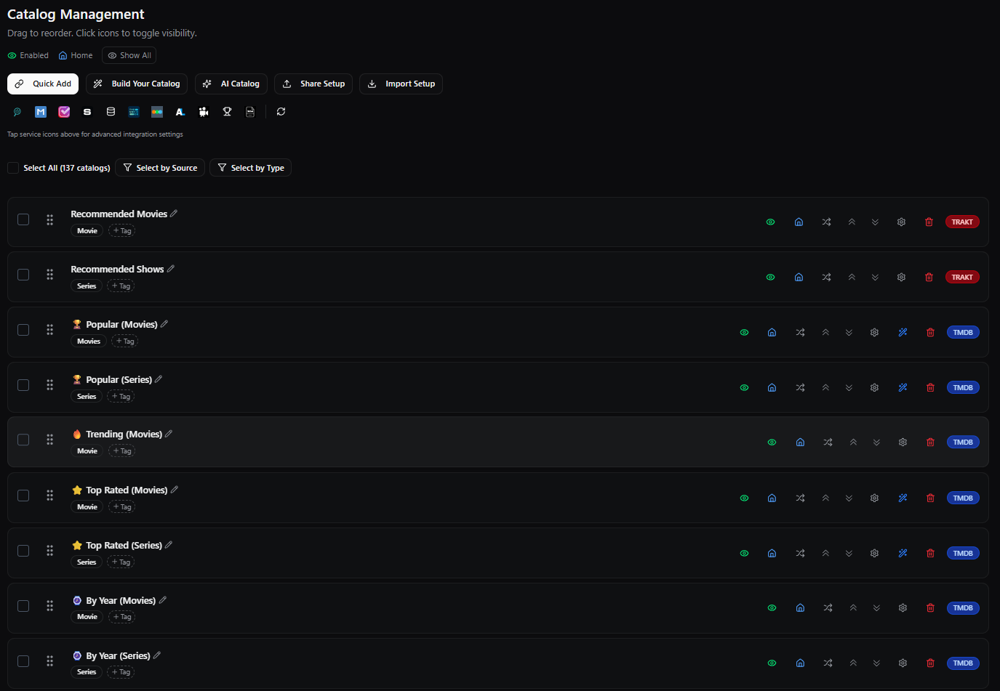
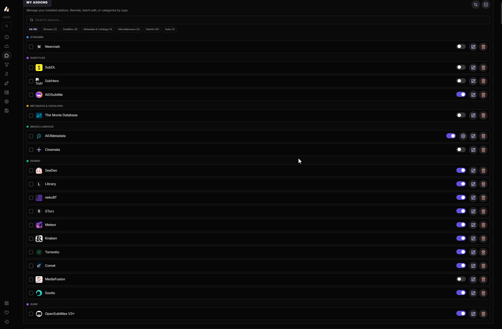
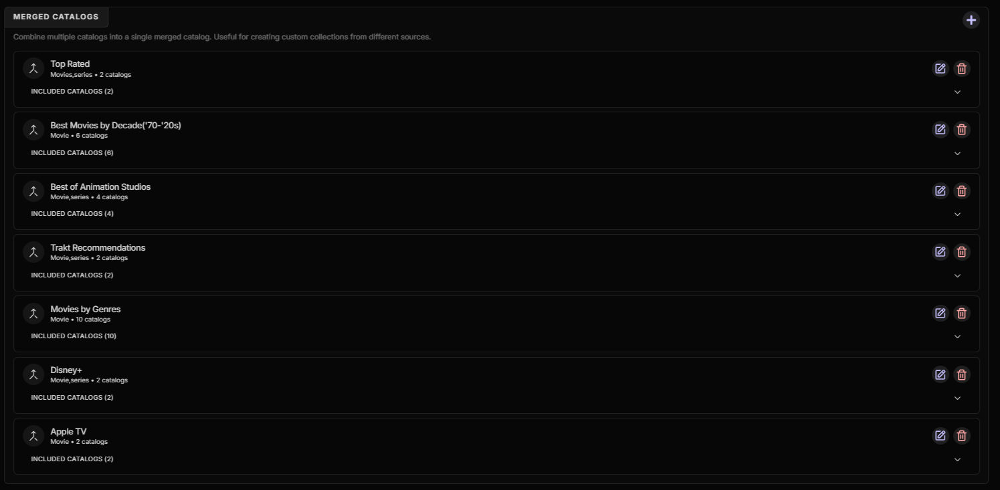
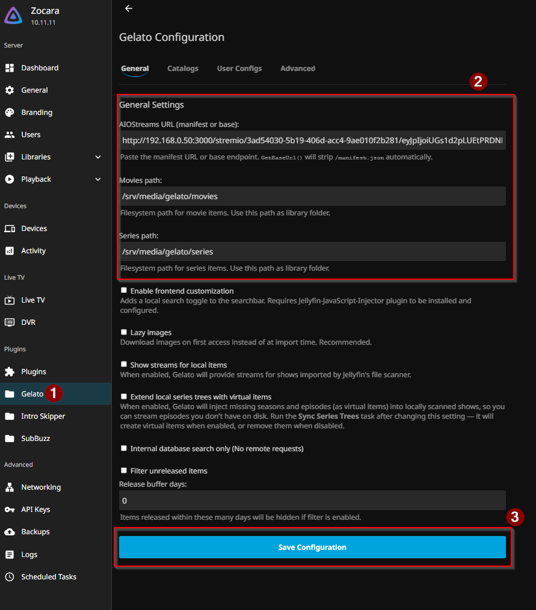
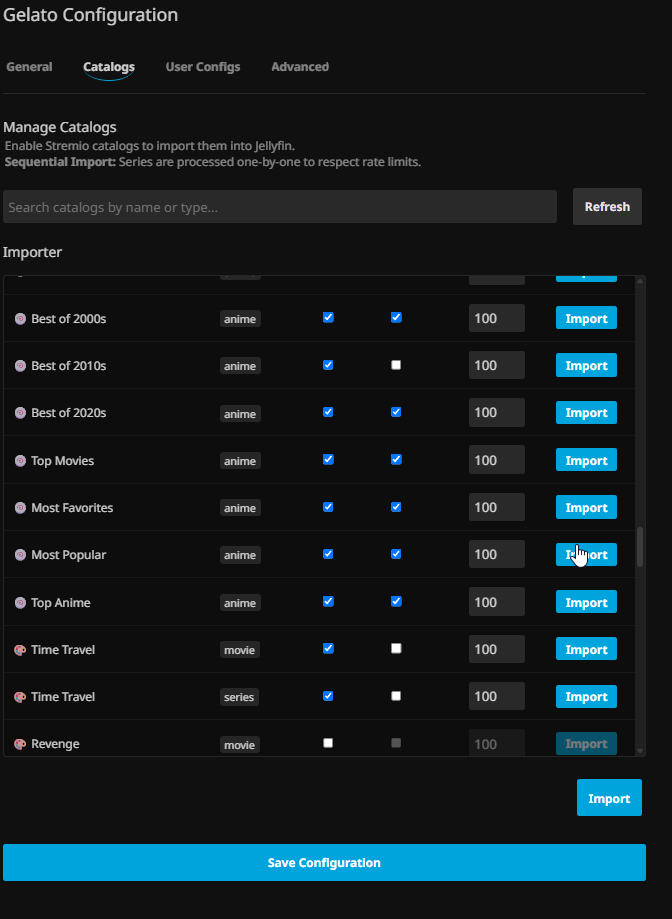

# 10 · Streaming Tier (AIOStreams + AIOMetadata + Gelato)

This is the **Instant** backbone — browse and stream huge catalogs on demand through debrid, with **no local storage**. Three pieces work together:

```
AIOMetadata  ─ catalogs + metadata ─┐
                                    ├─►  AIOStreams  ─ aggregate · filter/sort · merge ─►  manifest URL
TorBox + stream addons ─ streams ───┘                                                          │
                                                                                               ▼
                                                            Gelato (Jellyfin plugin)  ─►  Instant libraries + Collections
```

- **AIOMetadata** provides the *catalogs and metadata*.
- **AIOStreams** is the *aggregator*: it pulls AIOMetadata's catalogs **and** the stream sources (TorBox + addons), filters/sorts/merges everything, and outputs a single Stremio manifest.
- **Gelato** (a Jellyfin plugin) consumes that manifest, injects the catalogs as **Instant** libraries + **Collections**, and resolves playback back through AIOStreams.

---

## 1. AIOMetadata — catalogs & metadata

Self-hosted on port `3232` (`/configure` to set up).

- **Base:** the **luckynumb3rs** catalog set — the emoji-prefixed 🏆 Popular / 🔥 Trending / ⭐ Top Rated / 🎭 Genres / 🎬 Streaming / 🍥 Anime catalogs. Import it: download luckynumb3rs' `AIOMetadata.json` and load it via **Configuration → Import Configuration**.
- **Integrations tab:** enter your TMDB, TheTVDB, RPDB keys.
- **Providers (this build):** movies → TMDB, series → TheTVDB, anime → MAL.
- **Trakt:** connect it in the **Catalogs** tab (self-hosted needs its own Trakt app — same flow as the Trakt setup we used; required for the personalized Recommendations catalog).
- ~250 catalogs are available; this build enables ~137. **Trim to what you'll actually use** — Stremio caps around 120 catalogs.
- **Save Configuration**, then copy the AIOMetadata **manifest URL** — you'll paste it into AIOStreams next.



> Credit: catalog set by **[luckynumb3rs](https://luckynumb3rs.github.io/stremio-perfect-setup/guide/4-AIOMetadata/)**. Project: [cedya77/aiometadata](https://github.com/cedya77/aiometadata).

---

## 2. AIOStreams — the aggregator

Self-hosted on port `3000`. This is the hub that ties catalogs + streams together.

- **Template:** built on **Tam-Taro's "Complete" template** (`tamtaro.complete`) — a community template that ships sensible filtering, per-type sorting, and a custom formatter, so you don't configure all of that by hand. Apply it from the templates section. (Source: [Tam-Taro](https://github.com/Tam-Taro/SEL-Filtering-and-Sorting) · `https://git.tamtaro.de/complete.json`)
- **Debrid:** *Services* → enable **TorBox** and paste your token. (This build uses TorBox only; the other debrid/usenet services are left off.)
- **Stream addons:** the enabled providers that supply the actual streams — Torrentio, Comet, Sootio, nekoBT, Knaben, STorz (Torznab), Meteor, SeaDex (anime), Library — plus subtitle addons (OpenSubtitles V3+, AIOSubtitle).
- ⭐ **Add AIOMetadata as a custom addon** — this is the key integration step. *Addons → Custom* → paste your **AIOMetadata manifest URL** → name it `AIOMetadata`. That's what brings the luckynumb3rs catalogs into AIOStreams.



- **Merged catalogs:** AIOStreams combines movie + series catalogs into single 50/50 ones. This build's merges: **Top Rated**, **Best Movies by Decade**, **Best of Animation Studios**, **Trakt Recommendations**, **Movies by Genres**, **Disney+**, **Apple TV**. Create them under *Catalog Modifications → Merged Catalogs*.



- **Save**, then copy the AIOStreams **manifest URL**: `http://<host-ip>:3000/stremio/<your-uuid>/manifest.json` — this is the single URL Gelato consumes.

> Project: [Viren070/AIOStreams](https://github.com/Viren070/AIOStreams) · [docs](https://docs.aiostreams.viren070.me).

---

## 3. Gelato — bring it into Jellyfin

Install the **Gelato** plugin (custom repo — see [`08-jellyfin.md`](08-jellyfin.md)). Then:

**General Settings:**
- **AIOStreams URL:** paste the AIOStreams manifest URL from step 2.
- **Movies path:** `/srv/media/gelato/movies` · **Series path:** `/srv/media/gelato/series`.



**Create the Instant libraries** in Jellyfin (Dashboard → Libraries):
- **Instant Movies** (type Movies) → `/srv/media/gelato/movies`
- **Instant Shows** (type Shows) → `/srv/media/gelato/series`

**Catalogs tab:** enable the catalogs you want imported (they come from AIOMetadata via AIOStreams), set a per-catalog item limit (~100), and import. Imports run sequentially (to respect rate limits) and on a scheduled task.



### ⚠️ Two must-do fixes (or it breaks)

1. **Disable Jellyfin's "Clean up collections and playlists"** scheduled task — it *empties* the collections Gelato fills. (Covered in `08-jellyfin.md`.)
2. **Never full-scan the Instant libraries** — a full scan hangs on the streaming items. Use targeted scanning instead (`optional/targeted-scanning.md`). Keep trickplay/chapters **off** for these libraries.

> Project: [lostb1t/Gelato](https://github.com/lostb1t/Gelato).

---

## 4. The result

- **Instant Movies / Instant Shows** — browse and stream enormous catalogs on demand (via TorBox), with zero local storage.
- **Collections** — your merged 50/50 catalogs (Top Rated, Decades, Animation Studios, Trakt Recommendations, Genres, Disney+, Apple TV) appear right in Jellyfin.
- Hit play → Gelato resolves the stream through AIOStreams → TorBox → it plays. No download, no wait.

---

## Credits & templates

- **AIOMetadata catalogs** — based on **[luckynumb3rs](https://luckynumb3rs.github.io/stremio-perfect-setup/)**.
- **AIOStreams** — built on **[Tam-Taro's Complete template](https://github.com/Tam-Taro/SEL-Filtering-and-Sorting)**.
- Projects: [AIOStreams](https://github.com/Viren070/AIOStreams) · [AIOMetadata](https://github.com/cedya77/aiometadata) · [Gelato](https://github.com/lostb1t/Gelato).

⬅️ Back to [`00-overview.md`](00-overview.md) · that completes the build guide.
