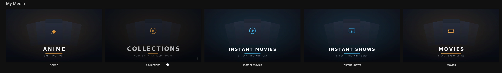

# Optional · Library Cover Art

⚙️ *Purely cosmetic.* A small script that generates a consistent, branded set of cover images for your Jellyfin library tiles — dark/cinematic, one per library, with a distinct icon and accent colour. Original artwork, so no copyright concerns.



---

## What it does

[`scripts/make-library-covers.py`](../../scripts/make-library-covers.py) renders 1920×1080 PNGs from an SVG template — a fanned-poster motif behind an emblem, a title, and a subtitle. This build uses **amber** for the local libraries (Movies, Shows, Anime) and **cyan** for the Instant ones, so they read as two groups at a glance.

---

## Usage

Needs `cairosvg`:

```bash
pip install cairosvg --break-system-packages
python3 scripts/make-library-covers.py
```

It writes a `covers/` folder with one PNG per library (`collections.png`, `movies.png`, `shows.png`, `anime.png`, `instant-movies.png`, `instant-shows.png`).

---

## Apply them in Jellyfin

For each library: *Dashboard → Libraries → (hover the library) → Edit Images → upload the matching PNG as the **Primary** image.*

---

## Customising

Open the script and edit the `LIBRARIES` list near the top — each entry is `(slug, TITLE, subtitle, accent, icon, …)`:

- **Accent** — `AMBER` or `CYAN` (or add your own gradient pair).
- **Icon** — `play`, `film`, `tv`, `star`, `boltcircle`, `boltbox` (defined in the `ICONS` dict).
- **TITLE / subtitle** — whatever text you want on the tile.

Re-run the script to regenerate.

⬅️ Back to [`08-jellyfin.md`](../08-jellyfin.md)
